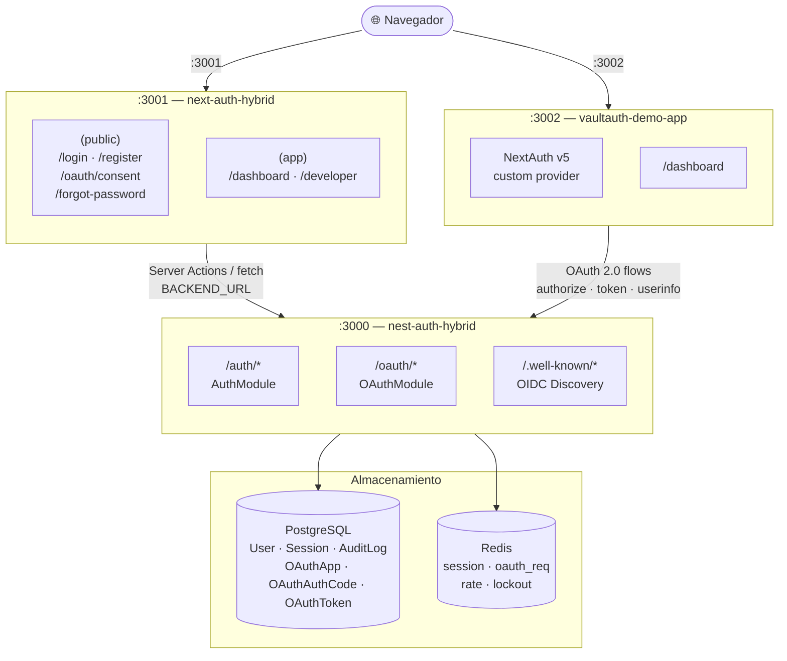
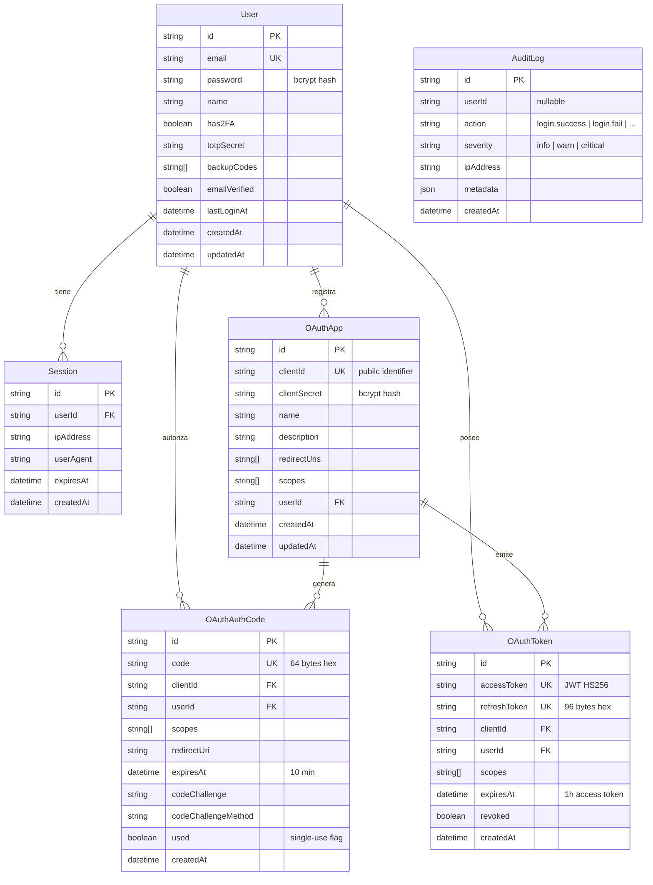
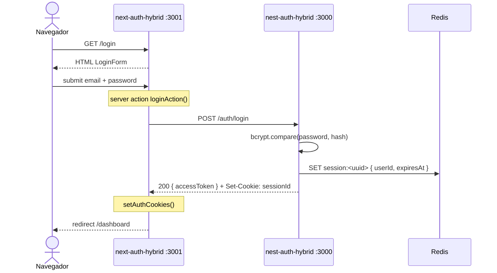
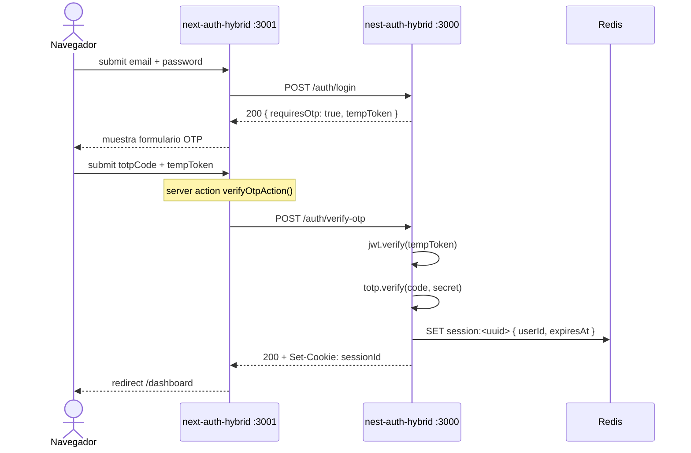
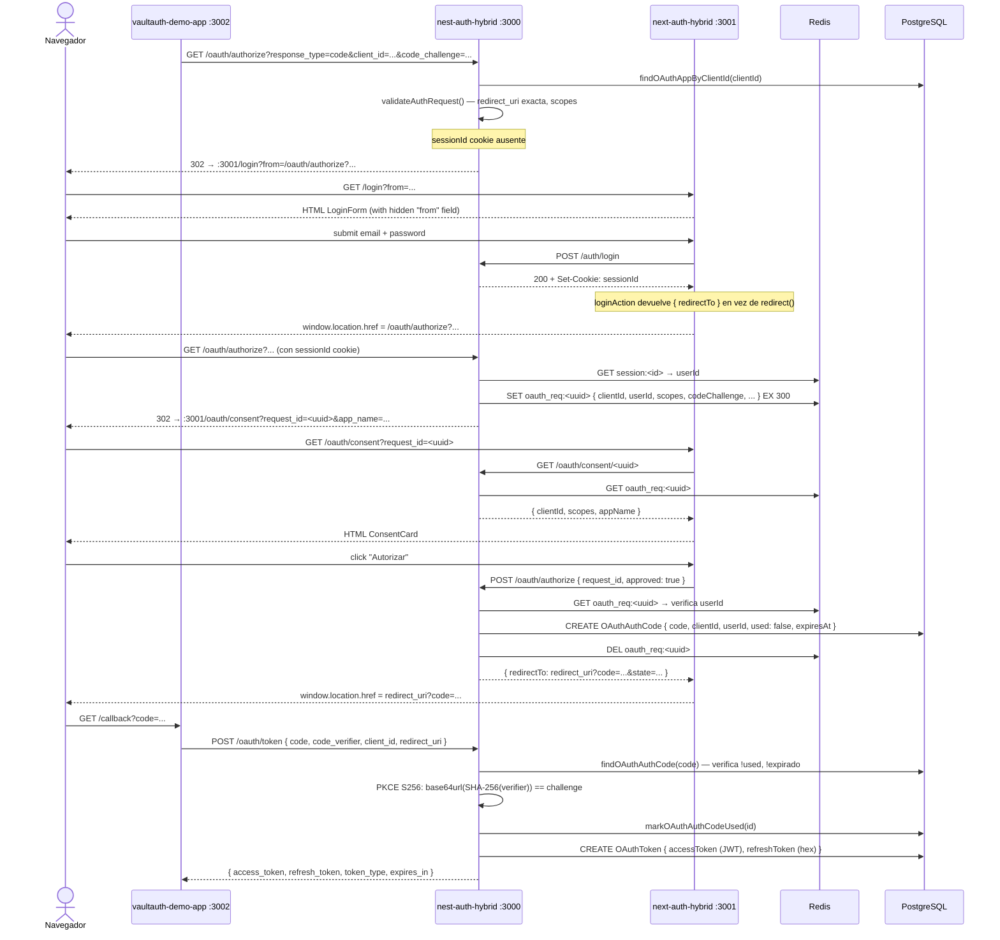
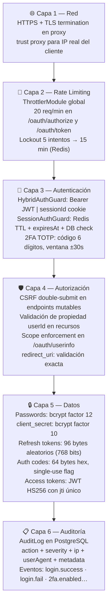

# Arquitectura del sistema — VaultAuth

Visión completa del ecosistema VaultAuth: componentes, capas, modelo de datos, flujos de red y decisiones de infraestructura.

---

## Tabla de contenidos

- [Ecosistema: los tres repositorios](#ecosistema-los-tres-repositorios)
- [Diagrama de componentes](#diagrama-de-componentes)
- [Capas de la aplicación](#capas-de-la-aplicación)
- [Modelo de datos](#modelo-de-datos)
- [Flujos de red](#flujos-de-red)
- [Almacenamiento y estado](#almacenamiento-y-estado)
- [Seguridad en capas](#seguridad-en-capas)
- [Infraestructura y despliegue](#infraestructura-y-despliegue)

---

## Ecosistema: los tres repositorios

VaultAuth es un sistema distribuido compuesto por tres aplicaciones independientes con responsabilidades bien delimitadas:

| Repositorio          | Tecnología               | Puerto | Rol                                                                       |
| -------------------- | ------------------------ | ------ | ------------------------------------------------------------------------- |
| `nest-auth-hybrid`   | NestJS 11 + TypeScript   | `3000` | Authorization Server — API REST y servidor OAuth 2.0/OIDC                 |
| `next-auth-hybrid`   | Next.js 16 (App Router)  | `3001` | Portal de identidad — login, consentimiento OAuth, panel de desarrollador |
| `vaultauth-demo-app` | Next.js 15 + NextAuth v5 | `3002` | Aplicación cliente — demuestra la integración OAuth como tercero          |

La separación entre backend (`3000`) y frontend (`3001`) es deliberada: el backend nunca renderiza HTML y el frontend nunca contiene lógica de negocio de autenticación.

---

## Diagrama de componentes



---

## Capas de la aplicación

### nest-auth-hybrid (backend)

```
src/
├── app.module.ts                   ← módulo raíz; registra todos los submódulos
├── features/
│   ├── auth/                       ← registro, login, 2FA, sesiones, social OAuth
│   │   ├── auth.controller.ts
│   │   ├── auth.service.ts
│   │   └── strategies/             ← Passport: local, jwt, google, discord
│   └── oauth/                      ← Authorization Server RFC 6749
│       ├── oauth.controller.ts
│       ├── oauth.service.ts
│       └── dto/
├── modules/
│   ├── database/prisma/            ← PrismaRepository (wrapper tipado)
│   ├── redis/                      ← ioredis, REDIS_CLIENT token DI
│   └── session/                    ← SessionService: CRUD de sesiones en Redis
└── common/
    ├── guards/
    │   ├── hybrid-auth.guard.ts    ← Bearer JWT || sessionId cookie
    │   ├── session-auth.guard.ts   ← sessionId cookie + DB check
    │   ├── csrf.guard.ts           ← double-submit cookie pattern
    │   └── rate-limit.guard.ts     ← Redis INCR con ventana deslizante
    ├── decorators/
    │   ├── current-user.decorator.ts
    │   └── rate-limit.decorator.ts
    └── filters/                    ← exception filters globales
```

**Módulos de NestJS activos:**

| Módulo            | Responsabilidad                                                            |
| ----------------- | -------------------------------------------------------------------------- |
| `AuthModule`      | Registro, login, 2FA TOTP, sesiones, social OAuth (Google/Discord)         |
| `OAuthModule`     | Authorization Server: apps, authorize, token, userinfo, introspect, revoke |
| `DatabaseModule`  | Prisma singleton, PrismaRepository con todos los métodos de acceso a datos |
| `RedisModule`     | ioredis global, inyectable como `REDIS_CLIENT`                             |
| `SessionModule`   | Creación, lectura, renovación y revocación de sesiones en Redis            |
| `ConfigModule`    | Variables de entorno tipadas (NestJS ConfigService)                        |
| `JwtModule`       | JWT HS256 global para access tokens y temp tokens (2FA)                    |
| `ThrottlerModule` | Rate limiting global (complementa el guard Redis por ruta)                 |

---

### next-auth-hybrid (portal de identidad)

```
src/
├── app/
│   ├── (public)/                   ← rutas accesibles sin sesión
│   │   ├── login/                  ← LoginForm con server actions
│   │   ├── register/
│   │   ├── forgot-password/
│   │   ├── verify-email/
│   │   ├── reset-password/[token]/
│   │   └── oauth/consent/          ← pantalla de consentimiento OAuth
│   └── (app)/                      ← rutas protegidas (verifica sesión en layout)
│       ├── dashboard/              ← panel principal del usuario
│       └── developer/              ← gestión de aplicaciones OAuth propias
├── features/
│   ├── auth/
│   │   ├── actions/login.ts        ← server actions: loginAction, verifyOtpAction
│   │   ├── components/             ← LoginForm, RegisterForm, TwoFactorForm…
│   │   └── hooks/useMe.ts          ← React Query: GET /auth/me
│   └── oauth/
│       └── components/             ← ConsentCard, AppCard, CreateAppForm…
├── lib/
│   └── api.ts                      ← instancia Axios con baseURL → :3000
└── next.config.ts                  ← rewrites: /oauth/* → :3000/oauth/*
                                       /auth/*  → :3000/auth/*
```

**Patrones clave:**

- Las **server actions** hacen `fetch` directo al backend (`BACKEND_URL` env var). El resultado se devuelve al componente sin exponer el backend al navegador.
- Las rutas `(app)/` protegen su contenido en `layout.tsx` — si no hay sesión se llama a `redirect('/login')`.
- Los **rewrites** de `next.config.ts` proxean `/oauth/*` al backend, excepto `/oauth/consent` que es una página Next.js real (las páginas estáticas tienen prioridad sobre `afterFiles`).
- `window.location.href` en lugar de `router.push()` para el redirect post-login al flujo OAuth: `router.push` es soft-nav y no actualiza la URL del navegador al seguir una 302.

---

### vaultauth-demo-app (cliente OAuth)

```
src/
├── auth.ts                         ← NextAuth v5 config
│   └── providers: [VaultAuthProvider]  ← custom provider OIDC
├── app/
│   ├── api/auth/[...nextauth]/     ← handler NextAuth
│   └── dashboard/                  ← consume /oauth/userinfo con access_token
└── .env.local
    ├── AUTH_VAULTAUTH_ID           ← clientId de la app registrada en VaultAuth
    ├── AUTH_VAULTAUTH_SECRET       ← clientSecret (bcrypt en DB, plain aquí)
    └── AUTH_VAULTAUTH_ISSUER       ← http://localhost:3000
```

NextAuth descubre `/.well-known/openid-configuration`, inicia Authorization Code + PKCE automáticamente y gestiona el intercambio de tokens sin código adicional.

---

## Modelo de datos



---

## Flujos de red

### Login sin 2FA



---

### Login con 2FA



---

### OAuth Authorization Code + PKCE (usuario no autenticado)



---

## Almacenamiento y estado

### Redis — estado efímero

| Clave               | Valor                             | TTL              | Cuándo se crea                     | Cuándo se elimina                  |
| ------------------- | --------------------------------- | ---------------- | ---------------------------------- | ---------------------------------- |
| `session:<uuid>`    | `{ userId, expiresAt, ip, ua }`   | 7 días (sliding) | Login exitoso                      | Logout / revocación                |
| `oauth_req:<uuid>`  | `{ clientId, userId, scopes, … }` | 5 min            | GET /oauth/authorize (autenticado) | POST /oauth/authorize (consent)    |
| `rate:<ip>:<route>` | counter (INCR)                    | 60 s             | Primera petición en ventana        | Automático por TTL                 |
| `lockout:<email>`   | `"1"`                             | 15 min           | 5 fallos consecutivos de login     | Automático por TTL / login exitoso |

### PostgreSQL — estado persistente

| Tabla           | Escribe                       | Lee                               | Indexado por                    |
| --------------- | ----------------------------- | --------------------------------- | ------------------------------- |
| `User`          | Registro, social OAuth        | HybridAuthGuard, SessionAuthGuard | `email`                         |
| `Session`       | Login                         | GET /auth/sessions                | `userId`, `expiresAt`           |
| `AuditLog`      | Cualquier evento de seguridad | consultas de auditoría            | `userId`, `action`, `createdAt` |
| `OAuthApp`      | POST /oauth/apps              | /oauth/authorize, /oauth/token    | `userId`                        |
| `OAuthAuthCode` | issueAuthCode()               | exchangeCode()                    | `clientId`                      |
| `OAuthToken`    | issueTokens()                 | userinfo, introspect, refresh     | `clientId`, `userId`            |

---

## Seguridad en capas



---

## Infraestructura y despliegue

### Servicios requeridos

| Servicio   | Versión mínima | Propósito                                       |
| ---------- | -------------- | ----------------------------------------------- |
| Node.js    | 20 LTS         | Runtime de las tres aplicaciones                |
| PostgreSQL | 14             | Base de datos principal                         |
| Redis      | 7              | Sesiones, rate limit, OAuth requests temporales |
| Docker     | 24             | Contenedorización (opcional en desarrollo)      |

### Variables de entorno — nest-auth-hybrid

| Variable                     | Descripción                                    |
| ---------------------------- | ---------------------------------------------- |
| `DATABASE_URL`               | PostgreSQL connection string                   |
| `REDIS_URL`                  | Redis connection string                        |
| `JWT_SECRET`                 | Secreto HS256 para access tokens y temp tokens |
| `FRONTEND_URL`               | URL del portal (`http://localhost:3001`)       |
| `GOOGLE_CLIENT_ID / SECRET`  | Credenciales OAuth de Google                   |
| `DISCORD_CLIENT_ID / SECRET` | Credenciales OAuth de Discord                  |

### Variables de entorno — next-auth-hybrid

| Variable              | Descripción                                       |
| --------------------- | ------------------------------------------------- |
| `BACKEND_URL`         | URL interna del backend (`http://localhost:3000`) |
| `NEXT_PUBLIC_API_URL` | URL pública del backend (para el navegador)       |

### Variables de entorno — vaultauth-demo-app

| Variable                | Descripción                                |
| ----------------------- | ------------------------------------------ |
| `AUTH_VAULTAUTH_ID`     | clientId de la app registrada en VaultAuth |
| `AUTH_VAULTAUTH_SECRET` | clientSecret (plain, solo en `.env.local`) |
| `AUTH_VAULTAUTH_ISSUER` | `http://localhost:3000`                    |
| `AUTH_SECRET`           | Secreto de NextAuth v5                     |

### Docker Compose (desarrollo)

```yaml
services:
  api: # nest-auth-hybrid   :3000
  postgres: # PostgreSQL         :5432
  redis: # Redis              :6379
```

El frontend (`next-auth-hybrid`) y la demo app (`vaultauth-demo-app`) se ejecutan fuera de Docker en desarrollo con `npm run dev`.

### Consideraciones de producción

- Separar PostgreSQL y Redis en servicios gestionados (RDS, ElastiCache, Upstash)
- Activar TLS en todas las conexiones inter-servicio
- Cifrar `totpSecret` en la base de datos con una KMS key externa
- Rotar `JWT_SECRET` con período de transición (soporte de múltiples secrets)
- Habilitar política de purga para `AuditLog` (retención configurable)

> Guía de despliegue detallada: [`guides/production.md`](./production.md)  
> Decisiones de diseño internas: [`technical.md`](./technical.md)
