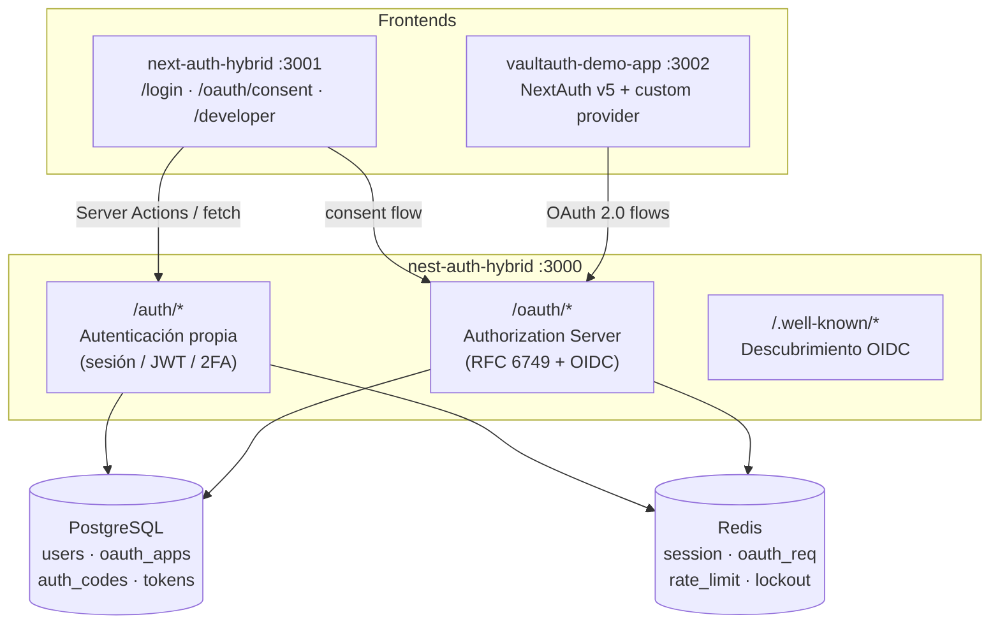
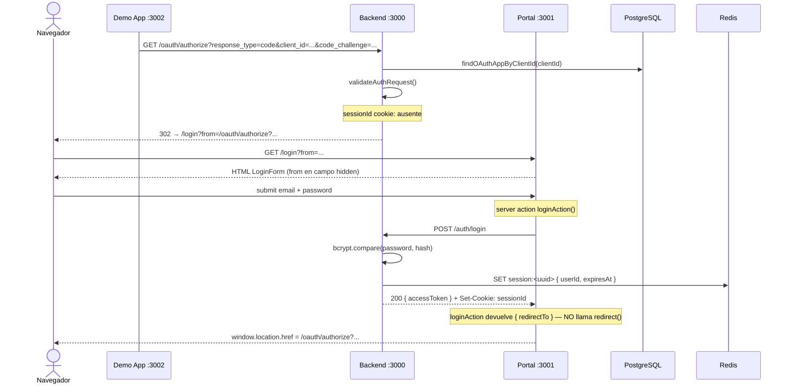
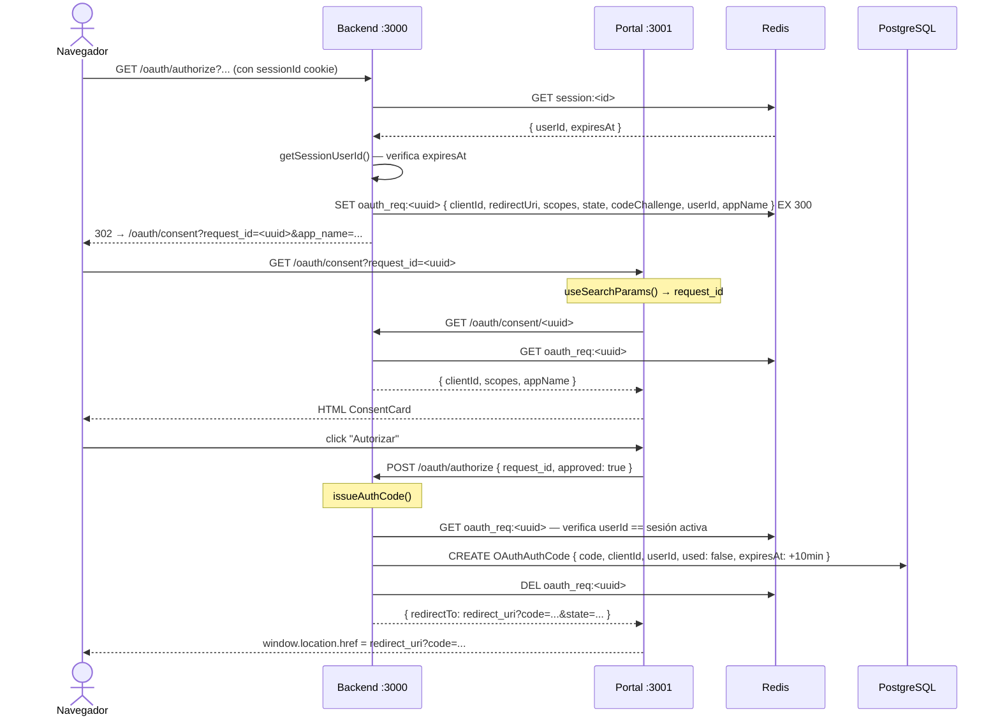
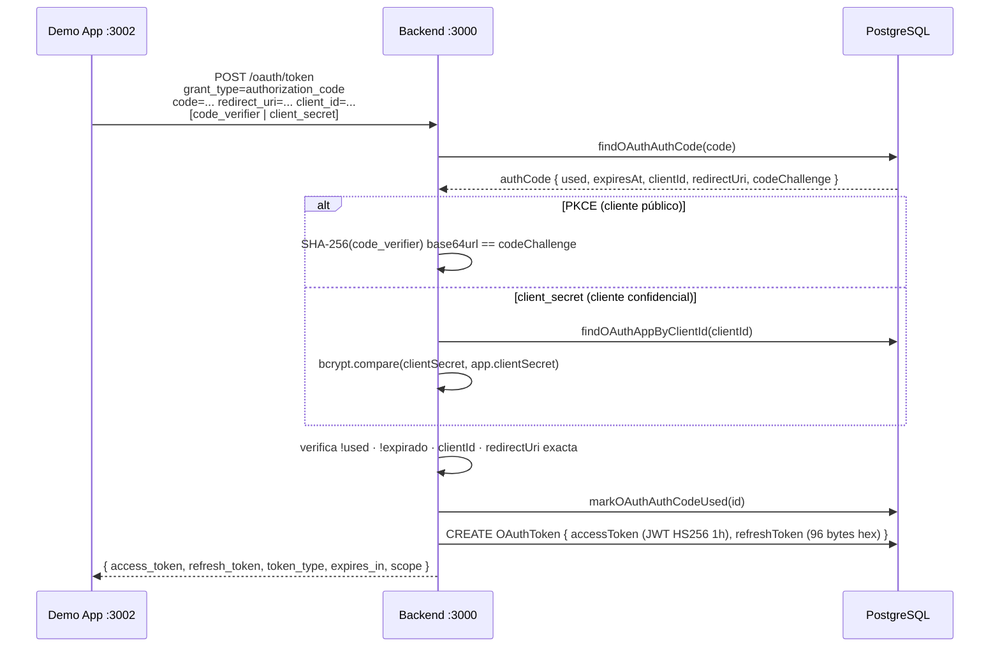
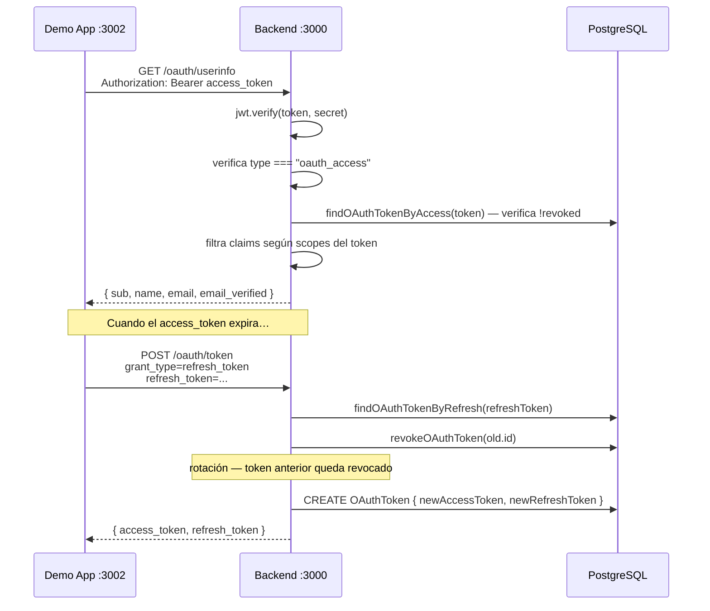
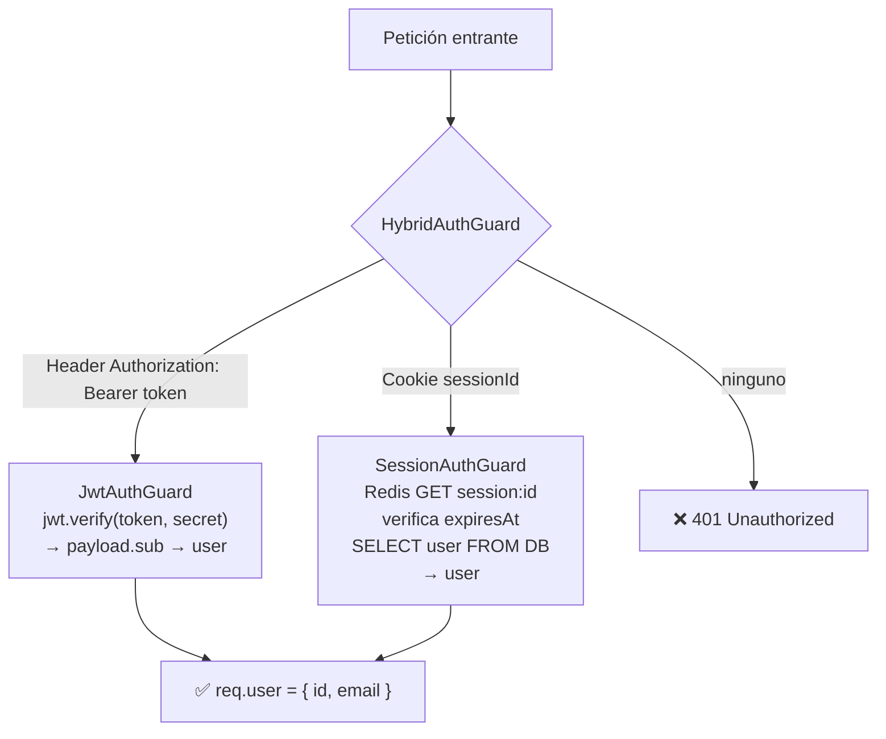

# Arquitectura técnica — VaultAuth

Decisiones de diseño, flujos internos y razonamiento de seguridad del sistema VaultAuth.

---

## Tabla de contenidos

- [Visión general del sistema](#visión-general-del-sistema)
- [Flujo completo: Authorization Code + PKCE](#flujo-completo-authorization-code--pkce)
  - [Paso 0: usuario no autenticado](#paso-0-usuario-no-autenticado)
  - [Paso 1–4: autorización y consentimiento](#paso-14-autorización-y-consentimiento)
  - [Paso 5: intercambio de código](#paso-5-intercambio-de-código)
  - [Paso 6–N: uso del access token](#paso-6n-uso-del-access-token)
- [Flujo de sesión híbrida (VaultAuth propio)](#flujo-de-sesión-híbrida-vaultauth-propio)
- [Almacenamiento: Redis vs PostgreSQL](#almacenamiento-redis-vs-postgresql)
- [Estrategia de tokens](#estrategia-de-tokens)
- [Decisiones de diseño](#decisiones-de-diseño)
- [Decisiones de seguridad](#decisiones-de-seguridad)
- [Concurrencia y condiciones de carrera](#concurrencia-y-condiciones-de-carrera)

---

## Visión general del sistema



---

## Flujo completo: Authorization Code + PKCE

### Paso 0: Usuario no autenticado



**Por qué `window.location.href` y no `redirect()` de Next.js:**
`redirect()` en un server action desencadena navegación suave (soft-nav). El servidor
sigue la 302 del backend sin actualizar la URL del navegador. `useSearchParams()` en
`/oauth/consent` lee desde la URL del navegador — que sigue siendo `/oauth/authorize?...`
— y devuelve `request_id = null`. `window.location.href` provoca un GET real del
navegador que sí actualiza la URL correctamente.

---

### Paso 1–4: Autorización y consentimiento



---

### Paso 5: Intercambio de código



---

### Paso 6–N: Uso del access token



---

## Flujo de sesión híbrida (VaultAuth propio)

El backend admite dos mecanismos paralelos para autenticar llamadas de la propia interfaz de VaultAuth:



La sesión vive en Redis con TTL, no en base de datos: invalidación inmediata O(1) sin JOINs.
La doble verificación (Redis TTL + `expiresAt` explícito) cubre el edge case donde Redis
no expira exactamente al segundo.

---

## Almacenamiento: Redis vs PostgreSQL

| Dato                         | Dónde      | TTL                           | Motivo                             |
| ---------------------------- | ---------- | ----------------------------- | ---------------------------------- |
| Sesiones de usuario          | Redis      | 7 días (sliding)              | Invalidación inmediata, sin JOIN   |
| Solicitudes OAuth pendientes | Redis      | 5 min                         | Efímero, no necesita persistencia  |
| Rate limit counters          | Redis      | 60 s (ventana)                | Atómico con INCR/EX                |
| Lockout de cuenta            | Redis      | 15 min                        | Temporal, reset automático         |
| Auth codes                   | PostgreSQL | 10 min (campo `expiresAt`)    | Auditoría, single-use flag         |
| Access/Refresh tokens        | PostgreSQL | Access: 1h / Refresh: sin TTL | Revocación por registro, auditoría |
| Aplicaciones OAuth           | PostgreSQL | Permanente                    | Configuración de cliente           |
| Usuarios                     | PostgreSQL | Permanente                    | Identidad principal                |

**¿Por qué los auth codes van a PostgreSQL y no a Redis?**
Los códigos se marcan como `used` al consumirse. Redis solo admite TTL, no estados
adicionales. Con PostgreSQL el flag `used` garantiza exactamente-una-vez incluso en
escenarios de reintentos concurrentes.

---

## Estrategia de tokens

### Access token — JWT HS256

```json
{
  "sub": "user_id",
  "client_id": "app_client_id",
  "scope": "openid profile email",
  "jti": "uuid-v4",
  "type": "oauth_access",
  "iat": 1715696400,
  "exp": 1715700000
}
```

**¿Por qué HS256 y no RS256?**
En un sistema de un solo servidor que controla emisión y verificación, HS256 elimina
la complejidad de gestión de claves públicas sin reducir la seguridad. RS256 aporta
valor cuando recursos externos verifican tokens sin pasar por el authorization server;
el endpoint `/oauth/introspect` cubre esa función para terceros.

**¿Por qué no hay `id_token`?**
Se optó por centralizar los claims de identidad en `/oauth/userinfo` en lugar de emitir
un `id_token` por separado. Elimina la duplicación de claims entre el JWT del token
endpoint y el userinfo, y simplifica la implementación. Los clientes usan el endpoint
estándar OIDC que ya tienen disponible.

### Refresh token — opaco

96 bytes aleatorios codificados en hex (192 caracteres, 768 bits de entropía).
Almacenado en PostgreSQL como texto plano porque actúa como clave de búsqueda.
La seguridad reside en la entropía, no en cifrado.

**Rotación en cada uso:** el token anterior queda revocado y se emite un par nuevo.
Si un token robado se usa después del refresh legítimo → el atacante recibe 401.
Si lo usa antes → el usuario legítimo pierde la sesión al siguiente refresh, señal de compromiso.

---

## Decisiones de diseño

### 1. Consent page en el frontend, no en el backend

El backend valida y almacena la solicitud OAuth en Redis, luego redirige al frontend
(`/oauth/consent?request_id=...`). El frontend renderiza la pantalla de consentimiento
y llama al backend para aprobar/denegar.

**Por qué:** permite usar el sistema de diseño y componentes React existentes.
El backend solo valida; nunca renderiza HTML.

### 2. `request_id` como clave de Redis en lugar de pasar parámetros por URL

Los parámetros OAuth completos (clientId, redirectUri, scopes, state, codeChallenge)
se almacenan en Redis bajo un UUID. Solo el UUID viaja en la URL de consentimiento.

**Por qué:**

- Evita URLs largas con datos sensibles visibles en logs de servidor
- Previene manipulación de parámetros en la URL de consentimiento
- El backend revalida todo desde Redis al momento de emitir el código

### 3. `from` param en login para preservar el flujo OAuth

Cuando el usuario no está autenticado, el backend redirige a:

```
/login?from=/oauth/authorize?response_type=code&client_id=...
```

El login form preserva `from` en un campo hidden y lo usa al redirigir tras autenticación.

**Alternativa descartada:** guardar el destino en la sesión Redis. Falla cuando el
usuario tiene múltiples pestañas abiertas o múltiples flujos OAuth en paralelo.

### 4. `getSessionUserId` manual en lugar de `HybridAuthGuard` en `/oauth/authorize`

`GET /oauth/authorize` necesita devolver 302 al login cuando el usuario no está
autenticado, en lugar de lanzar 401. `HybridAuthGuard` solo lanza excepciones, no redirige.

Solución: leer la cookie `sessionId` manualmente y verificarla con `getSessionUserId()`,
manteniéndola en OAuthService para tener toda la lógica de sesión OAuth en un solo lugar.

### 5. Soporte de `client_secret_basic` sin middleware global

El header `Authorization: Basic base64(id:secret)` se decodifica en el handler de
`POST /oauth/token` en lugar de en un interceptor global, evitando colisión con
`HybridAuthGuard` que también procesa `Authorization: Bearer`.

---

## Decisiones de seguridad

### PKCE obligatorio para clientes públicos (RFC 7636)

Los clientes sin `client_secret` deben incluir `code_challenge` (S256 preferido).
Sin PKCE, un atacante que intercepte el authorization code puede canjearlo sin secreto.

**Validación S256:** `base64url(SHA-256(code_verifier)) === code_challenge`

### Validación exacta de `redirect_uri`

Sin prefijos, wildcards ni comparaciones de origen. La URI debe coincidir exactamente
con la registrada en DB. Una URI parcialmente coincidente permitiría redirigir tokens
a un dominio controlado por el atacante.

### Rate limiting en `/oauth/authorize` y `/oauth/token`

20 req/min por IP con Redis (`INCR` + `EX`). Previene fuerza bruta sobre el flujo
de autorización sin dependencias externas adicionales.

### Bcrypt para `client_secret`

Almacenado como hash bcrypt (factor 10). El texto plano solo se devuelve una vez al
crear la app. Si la DB se ve comprometida, los secretos siguen siendo inútiles.

### Lockout de cuenta tras intentos fallidos

5 intentos fallidos → bloqueo de 15 minutos en Redis. El lockout es por email (no por IP)
para no penalizar redes NAT. El contador se resetea en login exitoso.

### Validación de `userId` al emitir el código

`issueAuthCode(requestId, userId)` verifica que el `userId` de la sesión activa coincide
con el almacenado en la solicitud OAuth. Previene que un usuario apruebe el consentimiento
de otro usuario si la sesión cambia durante el flujo.

### CSRF en endpoints con efecto de escritura

`POST /oauth/apps`, `DELETE /oauth/apps/:id`, `POST /oauth/apps/:id/regenerate-secret`
y `POST /oauth/authorize` (consent) requieren `CsrfGuard`. Los endpoints del token
(`/token`, `/introspect`, `/revoke`) son server-to-server y no requieren CSRF.

---

## Concurrencia y condiciones de carrera

### Auth code single-use

`markOAuthAuthCodeUsed` ejecuta un UPDATE en DB. Si dos peticiones simultáneas intentan
usar el mismo código, la segunda encontrará `used = true` y fallará.

### Refresh token race

Si dos peticiones simultáneas usan el mismo refresh token, ambas pasan la validación
`!revoked` antes de que ninguna ejecute `revokeOAuthToken`. La primera en completar el
UPDATE gana; la segunda podría emitir un segundo par de tokens válido por 1 hora.

Este es un tradeoff aceptado. La solución robusta requeriría `SELECT FOR UPDATE` o un
lock en Redis, añadiendo latencia en cada refresh. Para el perfil de uso de este sistema
no está justificado.
